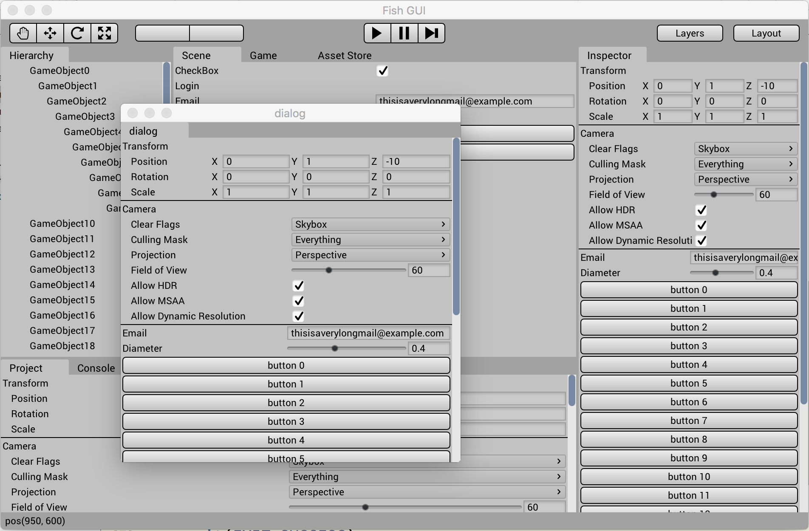

# FishGUI

FIshGUI is a immediate mode GUI([IMGUI](http://sol.gfxile.net/imgui/)) library, based on [NanoVG](https://github.com/memononen/nanovg).




## How to Build

### Linux

Tested on Ubuntu16.04

- If you don't have Boost installed:

```shell
sudo apt-get install boost
```

- build && test:

```shell
git clone https://github.com/yushroom/FishGUI.git
cd FishGUI
mkdir build && cd build
cmake ..
make

# run demo
../Binary/Demo
```

